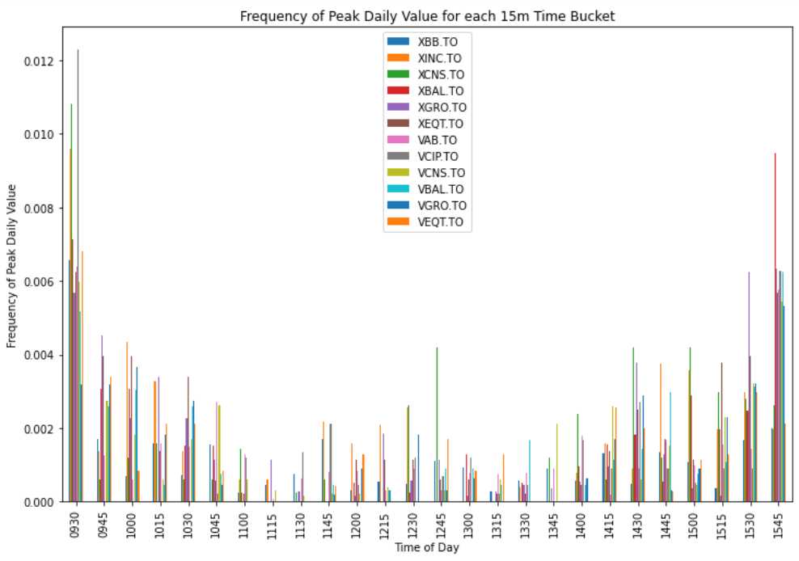
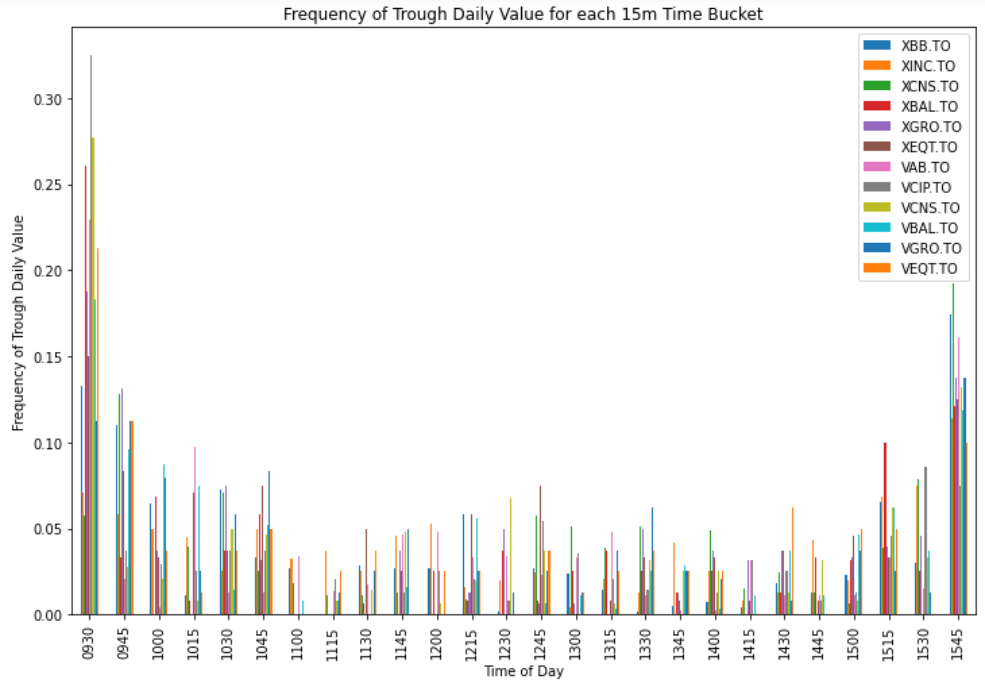
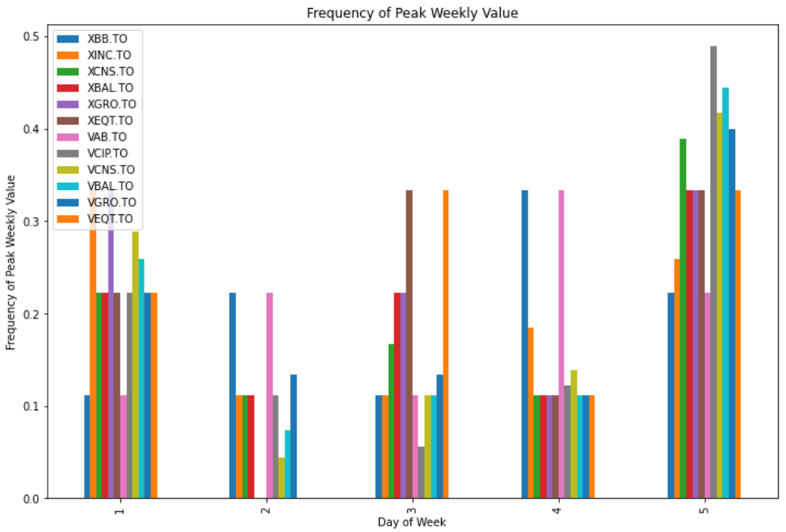
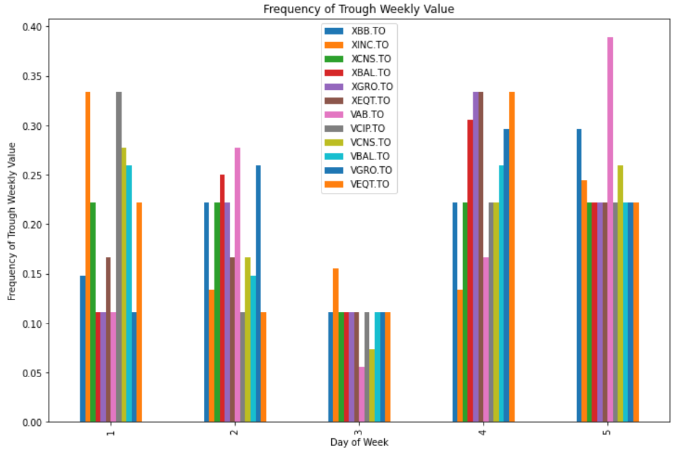

# Couch Potato Investment Timing

Index investing is a type of "passive" investing, where the investor buys and holds stocks that attempt to match the performance of a broad section of the stock market. This approach has historically shown to yield a good return on investment with minimal effort and minimal fees. The increased access for individuals to invest (as opposed to buying through a bank or brokerage), as well as sources like the [Canadian Couch Potato blog](https://canadiancouchpotato.com/), have popularized this investing strategy.

The Couch Potato strategy involves buying shares of [exchange-traded funds (ETFs)](https://en.wikipedia.org/wiki/Exchange-traded_fund) in a [dollar-cost averaging](https://en.wikipedia.org/wiki/Dollar_cost_averaging) strategy - that is, investing the same amount of money at regular intervals. Dollar-cost averaging "smooths" out the regular fluctuations of the stock market, and lends itself to automation. Making investments automatically can be an advantage to some people, because it reduces the temptation to buy or sell shares in a panic when prices dip or spike.

When automizing investments - for example, buying shares once per week - what is the best time of day, or best day of the week, to buy in? The data analysis in this repository aims to find out.

## Findings on a Small Data Set
Here are the results for some common Vanguard and iShares ETFs for a small date range (2020-09-24 through 2020-11-23):

	
	
	
	

There is not much to be gained by investing or selling at a particular time of day. Volatility is high at the open and close of the market each day, meaning that the prices are up to chance at that time. There is perhaps a marginal gain to be made by purchasing between 1 PM and 1:45 PM, and selling between 2 PM and 3 PM, but the data set is too small to say this with certainty.

The evidence for investing or selling on a particular day of the week is similarily weak. Monday and Friday are the most volatile, and should be avoided. Thursday is perhaps a good day for selling, as troughs are more common than peaks.

Again, these findings are based on only 60 days of data - no real conclusions can be made, only musings.

## Future Work
Some potential investigations and improvements are listed in the Issues section of this repository. Feel free to create an issue with a new idea, or open a pull request to address an existing issue.